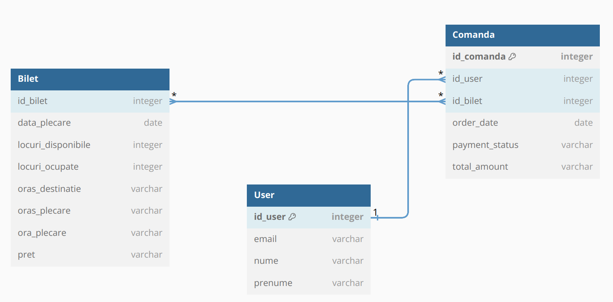
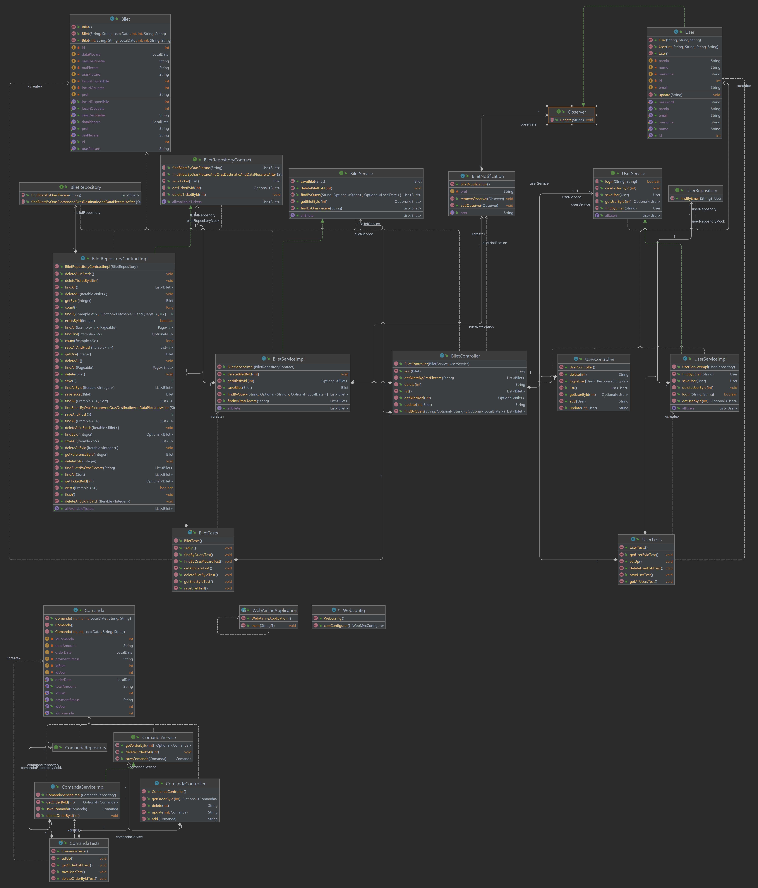
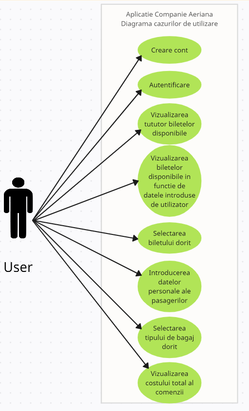

# _Proiectare_Software_
# _Aplicatie a unei companii aeriene pentru vanzarea biletelor de avion:_

## _**1. Descriere generala**:_
Acest proiect, dezvoltat cu ajutorul platformei Spring Boot, are ca scop crearea unei mediu virtual destinat rezervarii si cumpararii biletelor de avion, avand ca scop livrarea unei experiente eficiente utilizatorilor.

Aplicatia ofera urmatoarele **functionalitati** principale:

- cautarea zborurilor in functie de niste campuri pe care utilizatorul le completeaza(orasul de plecare, orasul destinatie, data plecarii, optional retur);
- daca nu exista un zbor direct, se afiseaza zboruri cu escala;
- utilizatorul trebuie sa aiba optiunea de a-si alege locul in avion;
- utilizatorul trebuie sa aiba optiunea de a alege tipul de bagaj(ex: de cala, de mana etc.);
- utilizatorul trebuie sa aiba posibilitatea de a-si crea un cont si de a se loga;
- aplicatia trebuie sa aiba functionalitati pentru unul sau mai multi admini, care sa poata adauga sau sterge zboruri si care sa poata modifica diferite aspecte prezente in aplicatie;
- utilizatorul trebuie sa poata introduce datele personale ale pasagerilor de pe un bilet;
- utilizatorul trebuie sa primeasca confirmarea rezervarii dupa completarea tuturor pasilor;

## **_2. Diagrama bazei de date:_**

- **Tabele:**
   - User: Acest tabel stocheaza informații despre utilizatorii care accesează platforma, cum ar fi numele, prenumele, adresa de email.
   - Bilet: Acest tabel stocheaza detalii despre biletele disponibile pentru achiziționare, cum ar fi ora și data plecării, locația de plecare și destinația, prețul etc.
   - Comanda: Acest tabel stocheaza detalii despre comenzi, cum ar fi id-ul utilizatorului care a făcut comanda, id-ul biletului achizitionat, data comenzii, starea platii, suma totala.

- **Relații între Entități:**
   - User către Comanda: Fiecare utilizator poate plasa una sau mai multe comenzi, deci ar exista o relație "one-to-many" între entitățile User și Comanda.
   - Comanda către Bilet: Fiecare comandă poate conține unul sau mai multe bilete, astfel încât ar exista o altă relație "many-to-many" între entitățile Comanda și Bilet.

## **_3. Apeluri HTTP:_**
**Apelurile HTTP** realizate în Postman sunt esențiale pentru testarea și dezvoltarea unei aplicații web. Iată câteva aspecte importante despre apelurile HTTP în Postman:

API este prescurtarea de la "Interfață de Programare a Aplicației" (Application Programming Interface). Este un set de reguli, protocoale și instrumente care permit interacțiunea și comunicarea între diferitele componente ale unei aplicații software sau între aplicații diferite.

**Testarea API-urilor:** Postman oferă un mediu de lucru prietenos pentru a trimite cereri HTTP către API-uri și a examina răspunsurile.

**Metode HTTP și Rute:** Se specifica metoda HTTP (GET, POST, PUT, DELETE etc.) și ruta (URL) către care se va trimite cererea. În plus, se pot adăuga și parametri, antete și corpuri de cerere, în funcție de necesitățile aplicației.

**Parametri și Antete:** Postman permite adaugarea unor parametri de query sau de cale în cerere, precum și antete personalizate, pentru a simula diferite scenarii și configurații.

**Descrierea Endpoint-urilor:**

- In cadrul claselor din pachetul **_controller_** au fost definite urmatoarele endpoint-uri: 
  - **_BiletController_**:
      - **@PostMapping("/add")** - permite adaugarea unui bilet nou in baza de date
      - **@DeleteMapping("/delete/{id}")** - permite stergerea unui bilet din baza de date in functie de id-ul specificat ca si parametru
      - **@PutMapping("/update/{id}")** - permite modificarea unui bilet deja existent in baza de date
      - **@GetMapping("/getAll")** - permite vizualizarea tuturor biletelor din baza de date
      - **@GetMapping("/getById/{id}")** - permite vizualizarea unui bilet in functie de id-ul specificat ca si parametru
      - **@GetMapping("/getByOrasPlecare")** - permite vizualizarea biletelor ce au orasul de plecare mentionat ca si parametru
      - **@GetMapping("/getByQuery")** - permite vizualizarea biletelor in functie de orasul de plecare, orasul destinatie si data specificate ca si parametri.
    
  - **_UserController_**:
      - **@PostMapping("/add")** - permite adaugarea unui nou utilizator in baza de date
      - **@GetMapping("/getById/{id}")** - permite vizualizarea utilizatorului cu un anumit id
      - **@DeleteMapping("/delete/{id}")** - permite stergerea unui utilizator in functie de id
      - **@PutMapping("/update/{id}")** - permite modificarea datelor unui utilizator deja existent
      - **@GetMapping("/getAll")** - permite vizualizarea tutoror utilizatorilor existenti in baza de date.

  - **_ComandaController:_**
      - **@PostMapping("/add")** - permite adaugarea unei noi comenzi in baza de date
      - **@GetMapping("/getById/{id}")** - permite vizualizarea unei comenzi in functie de id
      - **@DeleteMapping("/delete/{id}")** - permite stergerea din baza de date a unei comenzi in functie de id
      - **@PutMapping("/update/{id}")** - permite modificarea campurilor unei comenzi deja existente in baza de date.
  
În general, apelurile HTTP realizate în Postman sunt un instrument esențial pentru dezvoltatorii de software, oferindu-le posibilitatea de a testa, depana și îmbunătăți API-urile și aplicațiile lor într-un mod flexibil și interactiv.

## **_4. Implementarea Design pattern-ului Observer:_**
**Observer Pattern** este unul dintre cele mai cunoscute și folosite pattern-uri de proiectare în dezvoltarea de software. Acesta este un pattern de tip behavioral, care se concentrează pe modul în care un set de obiecte comunică și reacționează la modificări sau evenimente într-un alt obiect, numit subiectul observabil.
Atunci când starea subiectului observabil se schimbă, observatorii sunt notificați și pot reacționa în consecință.
 
Implementarea acestui design pattern are ca scop notificarea utilizatorilor in legatura cu scaderea sau cresterea preturilor biletelor de avion, reprezentand o modificare importanta aparuta in sistem.

Pentru realizarea acestei functionalitati, s-au urmat mai multi pasi:
- **injectarea** UserService în NotificationService, in scopul realizarii unui design corespunzător și a unei separari clare a responsabilităților.
- utilizarea unei liste de utilizatori pentru **observatori**: alegerea unei liste de utilizatori pentru a ține evidența observatorilor este o modalitate simplă și eficientă de a gestiona acești observatori.
- adăugarea și eliminarea facilă a observatorilor cu ajutorul metodelor subscribe() si unsubscribe(), precum și notificarea acestora despre evenimente importante, cum ar fi modificările de preț ale biletelor.

Prin urmare, prin realizarea unui apel HTTP in Postman, in care are loc modificarea pretului unui bilet de avion, va avea loc notificarea tuturor utilizatorilor cu privire la acest lucru.

## **_5. Testare_**

Testarea este o practică esențială în dezvoltarea de software, avand numeroase beneficii în ceea ce privește calitatea și fiabilitatea codului.

Testele se concentreaza pe testarea unitară a metodelor din clasele Service. Testarea unitară ajută la verificarea comportamentului corect al fiecărei componente a codului.

Framework-ul **Mockito** permite crearea obiectelor simulate folosind fie adnotarea @Mock, fie metoda statică mock().
- Metodele adnotate cu @Before sunt executate înainte de fiecare test.
- MockitoAnnotations.initMocks(this) - inițializeaza obiectele adnotate cu @Mock, @Spy, @Captor sau @InjectMocks.
- Metoda Mockito verify() de pe obiectul simulat verifică că o metodă este apelată cu anumiți parametri. În fiecare test, se verifica dacă metoda corespunzătoare a repository-ului este apelată cu parametrii așteptați. Acest lucru ajută la asigurarea faptului că serviciul interacționează corect cu repository-ul și apelează metodele dorite în funcție de cerințele testului.

Aceasta structura permite izolarea logicii care se testeaza și se concentreaza pe comportamentul componentei în mod separat.

## **_6. Diagrama UML_**

## **_7. Diagrama cazurilor de utilizare_**

