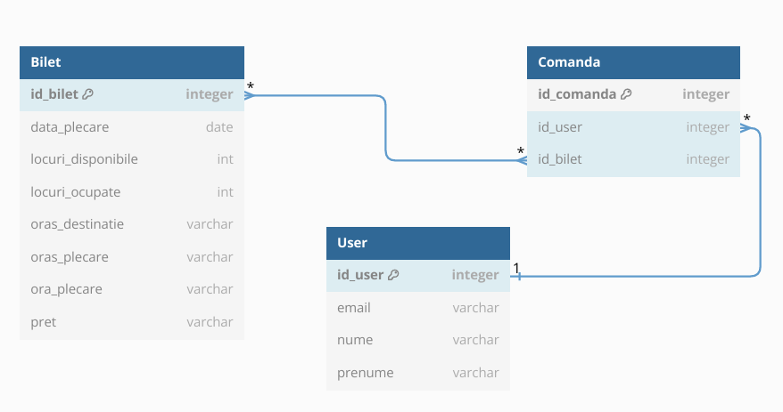

# Proiectare_Software
# Aplicatie a unei companii aeriene pentru vanzarea biletelor de avion:
Functionalitati: 

- cautarea zborurilor in functie de niste campuri pe care utilizatorul le completeaza(orasul de plecare, orasul destinatie, data plecarii, optional retur);
- daca nu exista un zbor direct, se afiseaza zboruri cu escala;
- utilizatorul trebuie sa aiba optiunea de a-si alege locul in avion;
- utilizatorul trebuie sa aiba optiunea de a alege tipul de bagaj(ex: de cala, de mana etc.);
- utilizatorul trebuie sa aiba posibilitatea de a-si crea un cont si de a se loga;
- aplicatia trebuie sa aiba functionalitati pentru unul sau mai multi admini, care sa poata adauga sau sterge zboruri si care sa poata modifica diferite aspecte prezente in aplicatie;
- utilizatorul trebuie sa poata introduce datele personale ale pasagerilor de pe un bilet;
- utilizatorul trebuie sa primeasca confirmarea rezervarii dupa completarea tuturor pasilor;

 

